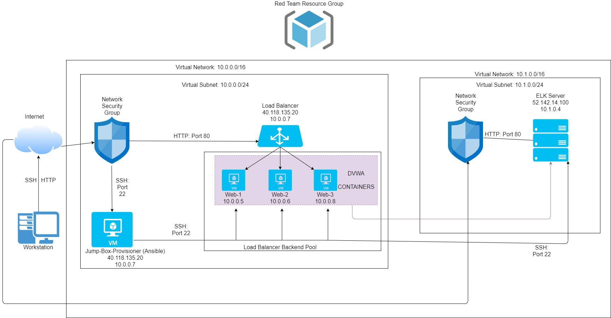
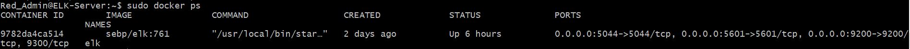

## Automated ELK Stack Deployment

The files in this repository were used to configure the network depicted below.

These files have been tested and used to generate a live ELK deployment on Azure. They can be used to recreate the entire deployment pictured above.

This document contains the following details:
- Description of the Topology
- Access Policies
- ELK Configuration
  - Beats in Use
  - Machines Being Monitored
- How to Use the Ansible Build

### Description of the Topology

The main purpose of this network is to expose a load-balanced and monitored instance of the DVWA web application.

Load balancing ensures that the application will be highly available, in addition to restricting access to the network.

Integrating an ELK server allows users to easily monitor the vulnerable VMs for changes to the filesystem and system usage and uptime.

The configuration details of each machine may be found below.

|    Name    |    Function    |       IP Address       |
|:----------:|:--------------:|:----------------------:|
|  Jump-Box  |     Gateway    | 40.118.135.20 10.0.0.7 |
|    Web-1   |   Web Server   |        10.0.0.5        |
|    Web-2   |   Web Server   |        10.0.0.6        |
|    Web-3   |   Web Server   |        10.0.0.8        |
| ELK-Server | Log Management | 52.142.14.100 10.1.0.4 |

### Access Policies

The machines on the internal network are not exposed to the public Internet. 

Only the Jump-Box 10.0.0.7 machine can accept connections from the Internet. Access to this machine is only allowed from 73.92.115.14

Machines within the network can only be accessed by the Jump-Box 10.0.0.7.

A summary of the access policies in place can be found in the table below.

|    Name    | Publicly Accessible | Allowed IP Addresses |
|:----------:|:-------------------:|:--------------------:|
|  Jump-Box  |         Yes         |     73.92.115.14     |
|    Web-1   |          No         |           -          |
|    Web-2   |          No         |           -          |
|    Web-3   |          No         |           -          |
| ELK-Server |         Yes         |     73.92.115.14     |

### Elk Configuration

Ansible was used to automate configuration of the ELK machine. No configuration was performed manually, which is advantageous because it will ensure our scripts run identically everywhere. 

The playbook implements the following tasks:
- Install docker
- Install python3
- Install docker python module
- Enable docker service
- Download and launch the docker ELK container

The following screenshot displays the result of running `docker ps` after successfully configuring the ELK instance.

### Target Machines & Beats
This ELK server is configured to monitor the following machines:
- 10.0.0.5
- 10.0.0.6
- 10.0.0.8

We have installed the following Beats on these machines:
- filebeat

These Beats allow us to collect the following information from each machine:
- changes to the filesystem

### Using the Playbook
In order to use the playbook, you will need to have an Ansible control node already configured. Assuming you have such a control node provisioned: 

SSH into the control node and follow the steps below:
- Copy the elk_playbook file to your Ansible container.
- Update the hosts file to include the machines in the network, list the web server IPs under the "webservers" section, list the ELK machine under the "elkservers" section
- Run the playbook, and navigate to the IP address that the machine is hosted on to confirm the ELK service is running properly

You can find the playbook files here:
[elk_playbook.yml](Files/elk_playbook.yml)
[filebeat_playbook.yml](Files/filebeat_playbook.yml)
